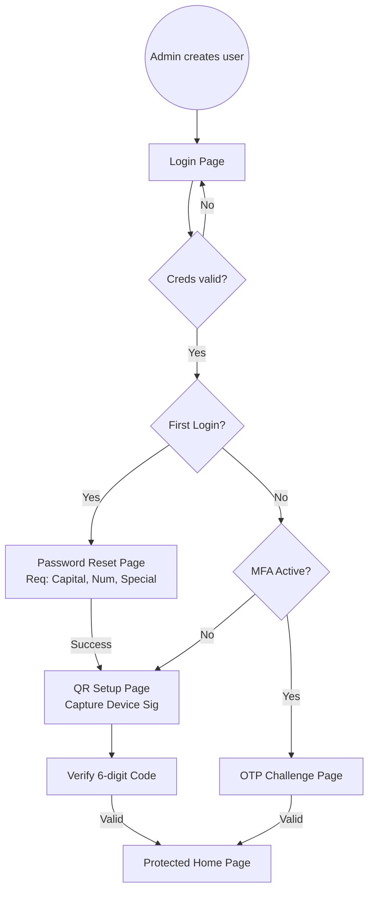


# SecureAuth TOTP Workflow (React + Vite)

A comprehensive React implementation of a secure authentication lifecycle featuring admin-led user provisioning, mandatory first-time password resets, QR-based TOTP onboarding, and device identity logging.

## 🚀 Overview
This project demonstrates a "Vault" style authentication system. It is designed to simulate a real-world enterprise workflow where users don't sign up themselves, but are instead "provisioned" by an administrator with temporary credentials.

## 🛠 Platform & Database Recommendation
- **Frontend**: React 19 + Vite 6, Tailwind CSS, Lucide React, `qrcode.react`.
- **Security**: `crypto-js` for SHA-256 client-side hashing (simulating secure transmission).
- **Recommended Database**: **PostgreSQL** (via Supabase, Neon, or RDS). 
  - *Why?* PostgreSQL offers robust relational integrity for managing the link between user identities, encrypted TOTP secrets, device fingerprint hashes, and audit logs. Using a managed provider like Supabase adds built-in Auth and real-time capabilities perfect for this specific workflow.

## 🔐 Authentication Workflow
1.  **Provisioning**: Admin creates a `username` and `temporary_password` in the Admin Registry.
2.  **Initial Access**: User logs in with temporary credentials.
3.  **Mandatory Reset**: System detects `password_reset_required: true`. User is forced to a Reset Page where they must provide a complex password (Capital, Number, Special Character).
4.  **MFA Onboarding**: Upon password update, the system generates a 16-character Base32 secret and displays a QR code.
5.  **Device Fingerprinting**: During QR verification, the system captures a unique 12-bit hash of the user's environment (UA + Resolution) as a "Device Sig".
6.  **Handshake**: User enters the 6-digit code from their authenticator app to enable MFA.
7.  **Standard Login**: Future logins require `username + password` followed by a secondary `OTP Challenge` screen.

## 📊 Workflow Diagram


## 📍 Routes
- `/` - Public Landing Page with role-based entry points.
- `/login` - Credential gateway for Users and Admins.
- `/reset-password` - Mandatory complexity-enforced credential update.
- `/setup-qr` - TOTP secret generation and device fingerprint registration.
- `/otp` - Secondary verification challenge for active users.
- `/home` - Protected dashboard with session status and security logs.
- `/admin` - Master registry for identity and device management.

## 📁 Data Model (Demo Simulation)
The system uses `localStorage` to simulate a persistent backend and `sessionStorage` for active session markers:
- **Admin Record**: `{ username, password_hash }`
- **User Object**: 
  ```ts
  {
    username: string;
    password_hash: string;
    totp_secret: string;
    totp_enabled: 'Y' | 'N';
    registered_device_id: string; // Hash of UA + Screen
    password_reset_required: boolean;
  }
  ```

## 🏗 Deployment
This is a single-page application (SPA). To deploy:
1. Run `npm run build`.
2. Upload the `dist/` folder to Vercel, Netlify, or GitHub Pages.
3. *Note:* For production, ensure the `crypto-js` logic is moved to a secure Node.js backend to prevent secret exposure.

---
**Developed by Nayan**
Core Security Engine v2.4
