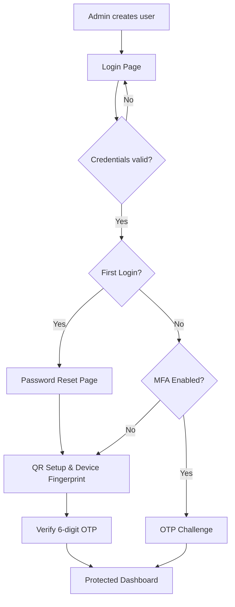

# 🔐 SecureAuth — TOTP Authentication Workflow  
**React + Vite | Enterprise-Style MFA Simulation**

🔗 **Live Demo:**  
👉 https://secure-auth-theta.vercel.app  

📦 **GitHub Repository:**  
👉 https://github.com/onlynayan/secure-auth

---

## 🚀 Project Overview

**SecureAuth** is a front-end simulation of a real-world **enterprise authentication lifecycle**, demonstrating **admin-controlled user provisioning**, **mandatory first-time password reset**, and **QR-based TOTP multi-factor authentication (MFA)**.

Users cannot self-register. All identities are provisioned by an administrator, closely reflecting corporate and government-grade security systems.

---

## 🌐 Live Demo

Explore the full authentication workflow here:

🔗 https://secure-auth-theta.vercel.app

---

## 🛠 Tech Stack

### Frontend
- React 19
- Vite 6
- Tailwind CSS
- Lucide React
- qrcode.react

### Security (Demo Simulation)
- crypto-js (SHA-256 hashing for demonstration)

### Storage (Demo Only)
- localStorage — user registry & MFA state
- sessionStorage — active session tracking

---

## 🔐 Authentication Workflow

1. Admin provisions a user with a temporary password  
2. User logs in using temporary credentials  
3. Mandatory password reset with complexity rules  
4. QR-based TOTP secret generation  
5. Device fingerprint captured (UA + Screen Resolution hash)  
6. OTP verification handshake  
7. Standard login requires password + OTP  

---

## 📊 Workflow Diagram



---

## 📍 Application Routes

| Route | Description |
|------|------------|
| `/` | Public landing page |
| `/login` | User & Admin login |
| `/reset-password` | Mandatory password reset |
| `/setup-qr` | QR + TOTP setup |
| `/otp` | OTP challenge |
| `/home` | Protected dashboard |
| `/admin` | Admin registry |

---

## 📁 Data Model (Simulation)

### Admin
```ts
{
  username: string;
  password_hash: string;
}
```

### User
```ts
{
  username: string;
  password_hash: string;
  totp_secret: string;
  totp_enabled: 'Y' | 'N';
  registered_device_id: string;
  password_reset_required: boolean;
}
```

---

## 🚀 Deployment

Deployed using **Vercel** with automatic GitHub integration.

```bash
npm install
npm run build
```

Output directory: `dist/`

Live URL: https://secure-auth-theta.vercel.app

---

## ⚠️ Security Disclaimer

This project is a **frontend-only demonstration**.

All cryptographic operations, secrets, and device fingerprints **must be handled server-side** in production systems.

---

## 👨‍💻 Author

**Nayan**  
Secure Authentication Workflow Demo  
Core Security Engine v2.4
