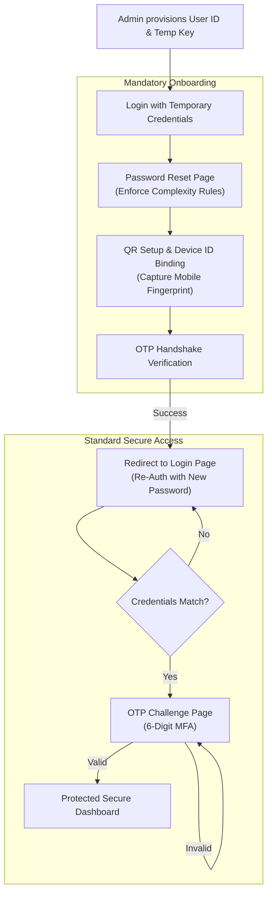

# 🔐 SecureAuth — TOTP Authentication Workflow  
**React + Vite | Enterprise-Style MFA Simulation**

🔗 **Live Demo:**  
👉 [https://secure-auth-theta.vercel.app](https://secure-auth-theta.vercel.app)  

📦 **GitHub Repository:**  
👉 [https://github.com/onlynayan/secure-auth](https://github.com/onlynayan/secure-auth)

---

## 🚀 Project Overview

**SecureAuth** is a front-end simulation of a high-security **enterprise authentication lifecycle**. It demonstrates a rigid security protocol involving **admin-controlled provisioning**, **mandatory credential rotation**, and **device-bound TOTP multi-factor authentication**.

This system is designed for environments where security is paramount and self-registration is prohibited.

---

## 🛠 Tech Stack & Security

### Core Technologies
- **Frontend**: React 19, Vite 6, Tailwind CSS
- **Icons**: Lucide React
- **MFA Engine**: `qrcode.react` for TOTP onboarding

### Security Architecture (Demo)
- **Zero Plain-Text Storage**: Passwords are never stored in plain text. Every credential is transformed into a **SHA-256 hash** immediately upon entry and stored only in hashed format within the simulated database.
- **Device Fingerprinting**: During the QR setup phase, the system captures a unique **Device Signature** (a composite hash of the User Agent and Screen Resolution). This signature is bound to the user profile to identify the trusted onboarding environment.
- **Complexity Enforcement**: The mandatory password reset stage requires a mix of capital letters, numbers, and special characters to mitigate brute-force risks.

---

## 📊 Authentication Workflow

The workflow is strictly sequenced to ensure maximum security during the onboarding process. After the initial MFA activation, the user is forced to re-authenticate with their new credentials to establish a clean session.



---

## 📍 Application Routes

| Route | Protocol Stage | Description |
|------|----------------|-------------|
| `/` | Public | Landing page with Admin and User entry points. |
| `/login` | Authentication | Dual-role login gate for identity verification. |
| `/reset-password` | Compliance | Mandatory first-time password rotation. |
| `/setup-qr` | Onboarding | TOTP secret generation and Device Signature binding. |
| `/otp` | Verification | Secondary challenge for authenticated users. |
| `/home` | Protected | Secure dashboard featuring system health logs. |
| `/admin` | Registry | Admin portal for provisioning and device auditing. |

---

## 🔑 Admin Access (Credentials)

To access the **Admin Panel** and provision users, use the following demo credentials:

```text
Username: admin
Password: admin
```

After logging in as **admin**, you can:

* Access the **Admin Registry (`/admin`)**
* Create new user records
* Trigger the full **MFA onboarding workflow** for users (password reset → QR setup → OTP verification)

> ⚠️ These credentials are **demo-only** and intended for simulation purposes.

---

## 📁 Data Structure (Secure Simulation)

### User Registry (Custom DB)
Passwords are stored as fixed-length hashes to ensure data privacy even in the event of a registry breach.
```ts
{
  username: string;
  password_hash: string;       // SHA-256 (No plain text stored)
  totp_secret: string;         // Base32 Secret
  totp_enabled: 'Y' | 'N';
  registered_device_id: string; // 12-bit Environment Hash
  password_reset_required: boolean;
  createdAt: string;
}
```

---

## 🚀 Deployment

The project is optimized for static hosting and deployed via **Vercel**.

```bash
# Build Instructions
npm install
npm run build
```

The production-ready assets are located in the `dist/` directory.

---

## 👨‍💻 Author

**Nayan**  
*Secure Authentication*  
**Core Security Engine v2.4**
